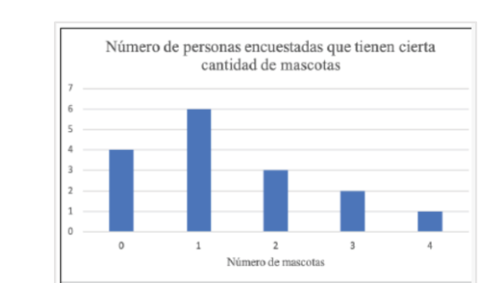
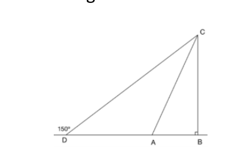
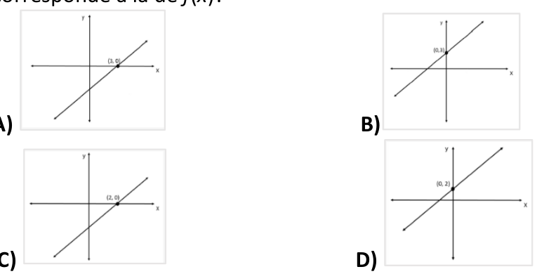
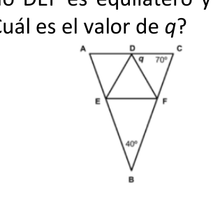
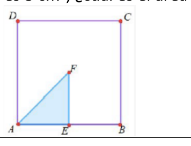

# Práctica Taller de Familiarización para la PAA

## Hoja de respuestas

**Instrucciones:** Utilice solamente lápiz número 2 para llenar esta
hoja de respuestas. Asegúrese de que cada marca sea oscura y llene
completamente el espacio que corresponde a la respuesta que escogió.
Borre completamente las respuestas que no desea incluir en la hoja.

**Nombre:**
\_\_\_\_\_\_\_\_\_\_\_\_\_\_\_\_\_\_\_\_\_\_\_\_\_\_\_\_\_\_\_\_  
**Escuela:**
\_\_\_\_\_\_\_\_\_\_\_\_\_\_\_\_\_\_\_\_\_\_\_\_\_\_\_\_\_\_\_\_

> **Nota de digitalización:** El PDF fuente no contiene una clave de
> respuestas. Las respuestas correctas no se han inferido ni agregado.

------------------------------------------------------------------------

## 1. Reactivo 1
La multiplicación siguiente, *p* y *q* representan dígitos diferentes a 0.`text\n  pp\n×  p\n----\n  q7p\n`¿Cuál es el valor de *q*?- **A)** 1- **B)** 2- **C)** 3- **D)** 4—\## 2. Reactivo 2sabe que a y b son números enteros positivos diferentes entre sí y distintos de 1. Además, a ≠ 3. Si n = 3 × a × b, ¿cuál de las siguientes expresiones es SIEMPRE divisible por n?- **A)** a × b × 12- **B)** a × b- **C)** b × 3- **D)** b × 9—\## 3. Reactivo 3la siguiente gráfica para contestar la pregunta. En la gráfica anterior, ¿cuál es la moda del número de mascotas de las personas encuestadas?- **A)** 1- **B)** 1.38- **C)** 2- **D)** 6—\## 4. Reactivo 4empresa desea realizar un estudio acerca de las actividades que realizan sus trabajadores en su tiempo libre. Sin embargo, por cuestiones de tiempo y dinero, no pueden obtener esta información. Por ello, seleccionan al azar 30 trabajadores de cada una de sus ocho áreas de trabajo y los encuestan. ¿Cuál es la muestra del estudio?- **A)** Todos los trabajadores de la empresa- **B)** Los trabajadores que realizan ciertas actividades en su tiempo libre- **C)** 30 de los trabajadores seleccionados- **D)** 240 trabajadores seleccionados—\## 5. Reactivo 5tiene 4 pares de zapatos, 6 camisas, 4 pantalones y 3 faldas. Si se pone una prenda de cada tipo a la vez, pero escoge una sola entre los pantalones y las faldas, ¿cuántas combinaciones de prendas puede hacer?- **A)** 6- **B)** 17- **C)** 168- **D)** 288—\## 6. Reactivo 6caja contiene dos tipos de piezas: discos y canicas. En total, hay 3 discos rojos, 2 discos azules, 5 discos amarillos, 8 canicas rojas, 4 canicas azules y 4 canicas amarillas. Al presionar un botón, cae una pieza al azar y la pieza no se introduce de nuevo en la caja. ¿Cuál es la probabilidad de que, al presionar el botón, caiga una canica y, al presionarlo de nuevo, caiga un disco?- **A)** 8/13- **B)** 2/5- **C)** 16/65- **D)** 40/169—\## 7. Reactivo 7m = 6 y n = 7, ¿cuál de las siguientes expresiones algebraicas es igual a 30?- **A)** 3(3m - (-3n))- **B)** 4m + -2(2n + 1)- **C)** 2(2m) + (-4n - 2)- **D)** 2(-m + n + 2n)—\## 8. Reactivo 8la expresión $a^4 \\times a^3 \\times a^{-1}$, si $a \\neq 0$.- **A)** a⁻¹²- **B)** a⁻⁶- **C)** a⁶- **D)** a¹²—\## 9. Reactivo 9la siguiente expresión. Luego, responda.$$10 - 6\\left(\\frac{4}{3}+\\frac{x-1}{x+2}\\right)=h$$$$\\frac{7x+5}{3x+6}=\\frac{11}{6},$$¿cuál es el valor de $h$ en la expresión anterior?- **A)** h = −1- **B)** h = 1- **C)** h = 4- **D)** h = 11/6—\## 10. Reactivo 10$3x^2-6=6$, ¿cuál es el valor de $2(x^2-5)-1$?- **A)** −3- **B)** −2- **C)** 0- **D)** 1—\## 11. Reactivo 11para cierto valor de $a$ la solución de la ecuación $2a\\sqrt{x}+4=3$ es $x=5$, entonces para ese mismo valor de $a$, ¿cuál es la solución de $4+a\\sqrt{x-2}=6$?- **A)** x = 1/2- **B)** x = 5- **C)** x = 18- **D)** x = 36—\## 12. Reactivo 12la siguiente figura, ACD es un triángulo isósceles. ¿Cuánto mide el ángulo ACB?- **A)** 30°- **B)** 45°- **C)** 60°- **D)** 90°—\## 13. Reactivo 13y Lucía compraron un boleto de lotería en \$25. Si Fernando aportó \$4 más que la mitad del dinero que aportó Lucía, ¿cuánto dinero aportó Fernando?- **A)** \$7- **B)** \$11- **C)** \$14- **D)** \$19—\## 14. Reactivo 14el campo de valores de la función $f(x)=-2x^2-12x+3$.- **A)** {y ∈ R / y ≥ −3}- **B)** {y ∈ R / y ≥ 21}- **C)** {y ∈ R / y ≤ 21}- **D)** {y ∈ R / y ≤ −3}—\## 15. Reactivo 15$f(x)=3x+2$, ¿cuál de las siguientes gráficas corresponde a la de f(x)?- **A)** Ver gráfica A- **B)** Ver gráfica B- **C)** Ver gráfica C- **D)** Ver gráfica D—\## 16. Reactivo 16$f(x)=2x$ y $g(x)=3x+2$, ¿cuál de las siguientes expresiones es equivalente a g(f(x))?- **A)** 6x + 2- **B)** 6x + 4- **C)** 6x² + 2- **D)** 6x² + 4—\## 17. Reactivo 17$f(x)=2x$ + 4 y $g(x)=3x$, ¿cuál de las siguientes expresiones es equivalente a f(g(3))?- **A)** 22- **B)** 30- **C)** 18x + 12- **D)** 27x + 4—\## 18. Reactivo 18la siguiente figura, el triángulo ABC es isósceles y el triángulo DEF es equilátero y está inscrito en el triángulo ABC. ¿Cuál es el valor de q?- **A)** 40- **B)** 60- **C)** 70- **D)** 110—\## 19. Reactivo 19¿Cuál es el valor de $n$ para que la ecuación$$\\frac{81^n\\cdot 9^n}{27^n}=3^{12}$$cumpla?\*Respuesta:\*\* \_\_\_\_\_\_\_\_\_\_\_\_\_\_\_\_\_\_\_\_—\## 20. Reactivo 20la siguiente figura. La figura muestra un cuadrado y un triángulo. Los vértices del triángulo son el centro del cuadrado, el punto medio del lado AB y el vértice A. Si el área del triángulo es 3 cm², ¿cuál es el área del cuadrado, en centímetros cuadrados?\*Respuesta:\*\* \_\_\_\_\_\_\_\_\_\_\_\_\_\_\_\_\_\_\_\_—
