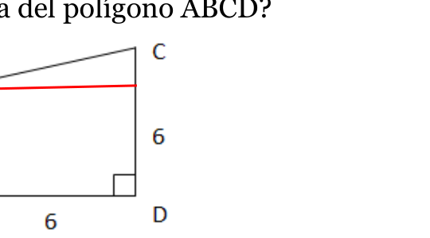
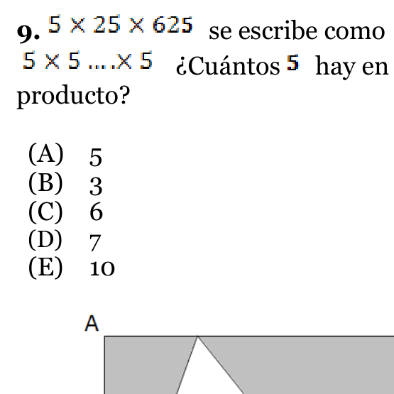
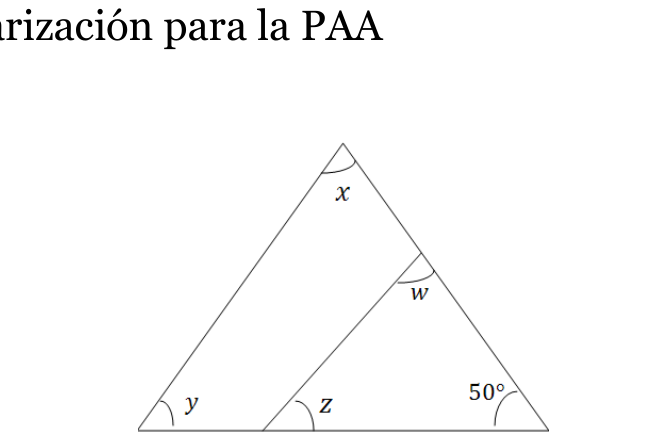
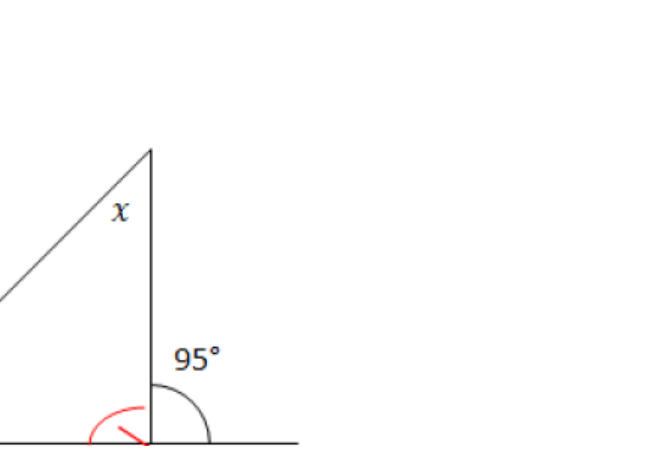

# Práctica Taller de Familiarización para la PAA

**Edición:** Ngj/2021

> Digitalización del PDF fuente. No se agrega una clave de respuestas.

---

## 1. Reactivo 1

Si $\frac{x-y}{2}=24$, entonces $x-y=$

- **A)** 6
- **B)** 12
- **C)** 24
- **D)** 48
- **E)** 96

---

## 2. Reactivo 2

Cierto número más tres veces el mismo número es igual a 64. La expresión es:

- **A)** x + x³ = 64
- **B)** 4x = 64
- **C)** 3x = 64
- **D)** x³ = 64
- **E)** x + 3 = 64

---

## 3. Reactivo 3

¿Cuál es el promedio de los números $x$, $y$ y $z$?

- **A)** 3xyz
- **B)** xyz
- **C)** xyz/2
- **D)** 3(x + y + z)
- **E)** (x + y + z)/3

---

## 4. Reactivo 4

El doble del cuadrado del producto de 5 y 3:

- **A)** 90
- **B)** 150
- **C)** 300
- **D)** 450
- **E)** 900

---

## 5. Reactivo 5

El promedio de temperaturas para 5 días fueron: 82°, 86°, 91°, 79° y 90°F. ¿Cuál es la media aritmética de estas temperaturas?

- **A)** 86°
- **B)** 85.6°
- **C)** 91°
- **D)** 84°
- **E)** 83.8°

---

## 6. Reactivo 6

¿Cuál es el área del polígono ABCD?

- **A)** 16
- **B)** 20
- **C)** 24
- **D)** 30
- **E)** 36

---

## 7. Reactivo 7

Si $x=\frac{2}{3}+\frac{3}{2}$, entonces $\frac{1}{x}=$

- **A)** 6/7
- **B)** 6/13
- **C)** 13/6
- **D)** 2
- **E)** 1/4

---

## 8. Reactivo 8

La asistencia regular a un cine en el estreno de una película es de sala llena durante los primeros 5 días, si se estrena en un día miércoles. Después de esos primeros 5 días, la asistencia va disminuyendo aproximadamente un tercio de la asistencia del día anterior. En una sala para 750 personas, ¿cuántos días, incluyendo el día del estreno, la sala tiene más de la mitad de las personas?

- **A)** 5
- **B)** 3
- **C)** 6
- **D)** 7
- **E)** 10

---

## 9. Reactivo 9

5 × 25 × 625 se escribe como 5 × 5 × 5 × 5 × 5 × 5. ¿Cuántos 5 hay en el producto?

- **A)** 5
- **B)** 3
- **C)** 6
- **D)** 7
- **E)** 10

---

## 10. Reactivo 10

Si ABCD es un cuadrado de 4 cm de ancho, ¿cuál es el área de la región sombreada, en centímetros cuadrados?

- **A)** 10
- **B)** 12
- **C)** 16
- **D)** 4
- **E)** 8

---

## 11. Reactivo 11

En la figura anterior, ¿cuál es el valor de x + y + z + w?

- **A)** 360°
- **B)** 310°
- **C)** 260°
- **D)** 230°
- **E)** 180°

---

## 12. Reactivo 12

En una encuesta realizada en 200 hogares de una ciudad, 130 tienen cisterna de agua, 90 tienen generador de electricidad y 50 tienen ambas cosas. Si se selecciona un hogar al azar, ¿cuál es la probabilidad de que tenga cisterna de agua?

- **A)** 1.54
- **B)** 0.65
- **C)** 0.45
- **D)** 0.5
- **E)** 0.2

---

## 13. Reactivo 13

La tabla anterior representa una relación entre x y y. El valor de y que falta en la tabla es:

| x | 0 | 1 | 2 | 3 |
|---|---:|---:|---:|---:|
| y | 0 | 1 | ? | 9 |

- **A)** 2
- **B)** 3
- **C)** 4
- **D)** 5
- **E)** 6

---

## 14. Reactivo 14

El volumen de un cubo es 64 cm³. El área en centímetros cuadrados de la superficie de una cara del cubo es:

- **A)** 6.4
- **B)** 12
- **C)** 16
- **D)** 4
- **E)** 8

---

## 15. Reactivo 15

La velocidad de un auto es 3 1/2 veces la velocidad de una bicicleta, ¿cuánto tarda la bicicleta en recorrer 500 kilómetros si un auto tarda 8 horas?

- **A)** 56 horas
- **B)** 35 horas
- **C)** 28 horas
- **D)** 24 horas
- **E)** 20 horas

---

## 16. Reactivo 16

¿De cuántas formas se puede seleccionar un platillo de entrada, un plato fuerte y un postre si se ofrecen 5 platillos diferentes de entrada, 8 platos fuertes y 3 postres?

**Respuesta:** ____________________

---

## 17. Reactivo 17

Si $|x+4|=2$, entonces $3-\frac{|x+4|}{2}=$

**Respuesta:** ____________________

---

## 18. Reactivo 18

En una clase de 50 estudiantes, 10 juegan futbol. ¿Qué porcentaje no juega futbol?

**Respuesta:** ____________________

---

## 19. Reactivo 19

En la figura, ¿cuál es el valor de x? 

**Respuesta:** ____________________

---

## 20. Reactivo 20

La distancia que viaja una piedra cuando cae de un edificio muy alto es directamente proporcional al cuadrado del tiempo del viaje. Si la piedra cae 24 metros en 4 segundos, ¿cuántos metros recorre la piedra en 6 segundos?

**Respuesta:** ____________________

---

## 21. Reactivo 21

El perímetro de una circunferencia es 3 veces el perímetro de otra, ¿cuántas veces el área de la circunferencia mayor es el área de la circunferencia menor?

**Respuesta:** ____________________

---
